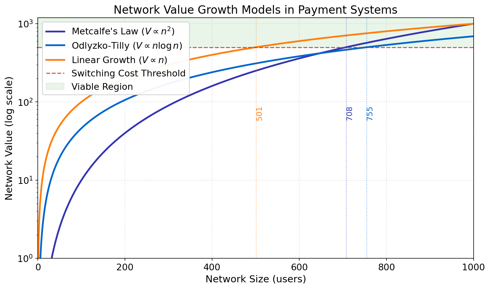

# Network Effects: When Does a Payment System Take Off?

**Assignment A4 Model Answer**

References:
- Metcalfe, B. (2013). "Metcalfe's Law after 40 Years of Ethernet"
- Odlyzko, A., & Tilly, B. (2005). "A refutation of Metcalfe's Law..."

---

## The Model: Three Network Value Functions

**Network value V as a function of n users:**

1. **Metcalfe's Law**: $V = \frac{n^2}{1000}$
   - Every user can connect to every other user
   - Total possible connections = n(n-1)/2 ≈ n²/2

2. **Odlyzko-Tilly**: $V = \frac{n \ln(n)}{10}$
   - Only close contacts matter (logarithmic decay)
   - More realistic for large networks

3. **Linear**: $V = n$
   - No network effects (baseline)

**Scaling factors** (1000, 10): Normalize raw connection counts to comparable value units

---

## Baseline Results (Threshold = 500)

**Critical mass points where V > 500:**

- **Linear**: n = 500 (V = n, so n = 500)
- **Metcalfe**: n = 708 (n²/1000 = 500 → n = √500,000 ≈ 707.1)
- **Odlyzko**: n ≈ 750 (solve n·ln(n)/10 = 500 numerically)

**Key insight**: Linear reaches critical mass FIRST (at n=500), while Metcalfe requires 42% more users (n=708). The n²/1000 scaling divisor means Metcalfe's quadratic advantage doesn't overcome the denominator until larger network sizes

---

## Variation 1: Lower Threshold (100)

**Critical mass points where V > 100:**

- **Linear**: n = 100
- **Metcalfe**: n = 317 (√100,000 ≈ 316.2)
- **Odlyzko**: n ≈ 278

**Key insight**: Lower switching costs favor rapid adoption even with weak network effects

---

## Variation 2: Higher Threshold (2,000)

**Critical mass points where V > 2,000:**

- **Linear**: n = 2,000 (beyond our 1000-user range)
- **Metcalfe**: n ≈ 1,414 (√2,000,000 ≈ 1,414.2, beyond range)
- **Odlyzko**: n > 1,000 (beyond range)

**Key insight**: High switching costs prevent any model from reaching critical mass within 1000 users. Payment systems need to lower barriers to adoption.

---

## Variation 3: Reed's Law (Exponential Growth)

**Reed's Law**: $V = 2^{n/10}$ (value from forming groups/coalitions)

**Critical mass for threshold = 500:**
- Reed's Law: n ≈ 90 (since 2^9 = 512 > 500)

**Comparison:**
- Reed: n = 90
- Metcalfe: n = 708
- Odlyzko: n = 750
- Linear: n = 500

**Key insight**: If group formation drives value (e.g., merchant networks), critical mass arrives much earlier

---

## The Role of Scaling Divisors

**Without divisors** (raw formulas):
- Metcalfe V = n²: Critical mass at n = 23 (√500 ≈ 22.4)
- Odlyzko V = n·ln(n): Critical mass at n ≈ 75

**With realistic divisors** (/1000, /10):
- Metcalfe: n = 708
- Odlyzko: n = 750

**What divisors represent:**
- **Economic interpretation**: Not all connections generate equal value
- Divisors calibrate theoretical models to empirical network value data
- Example: Facebook has 3 billion users, but value isn't 9×10¹⁸ dollars

**Key insight**: Scaling factors are essential for realistic predictions of when payment systems become viable
